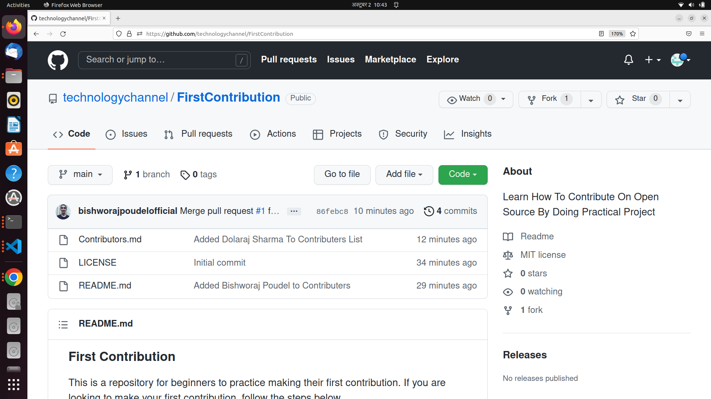
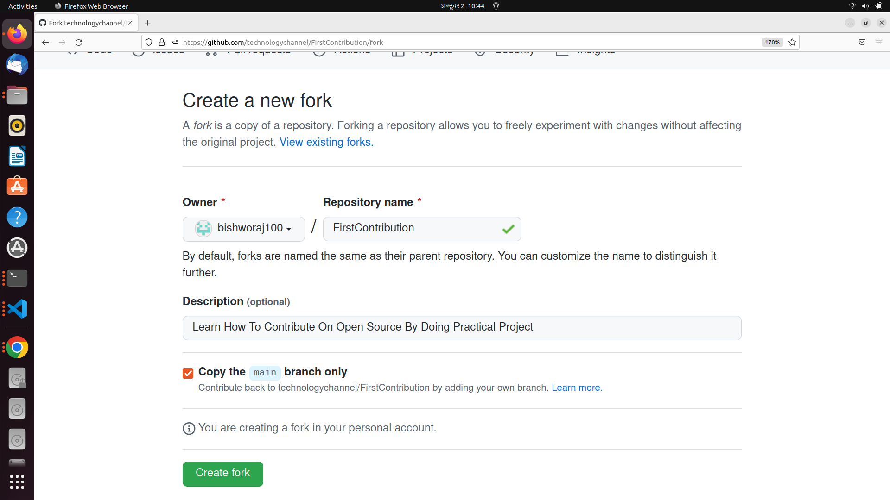
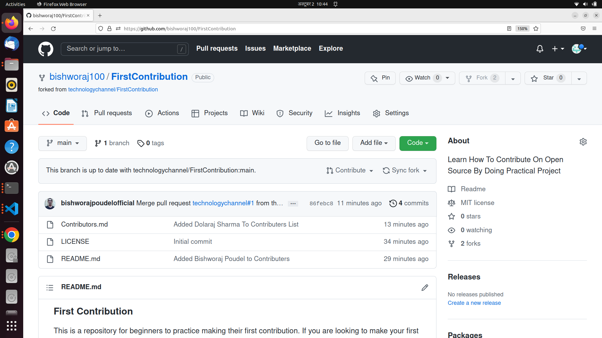
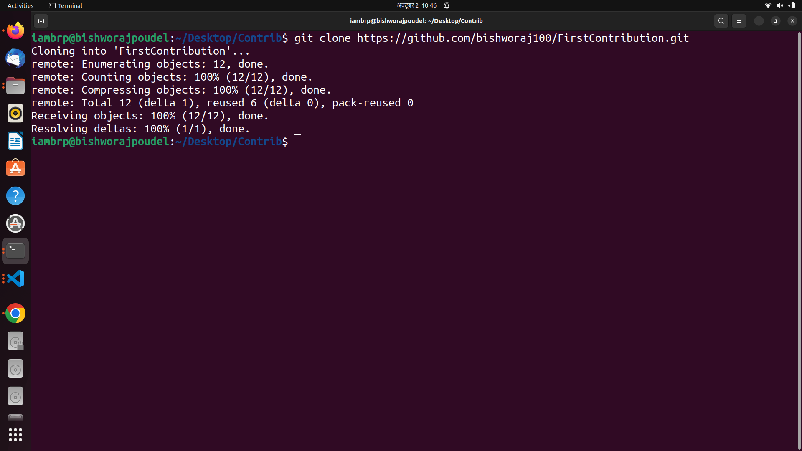
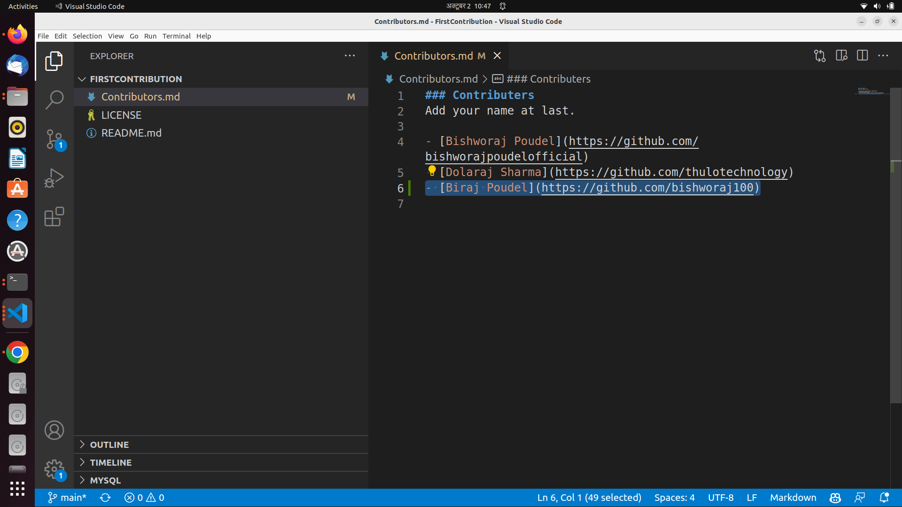
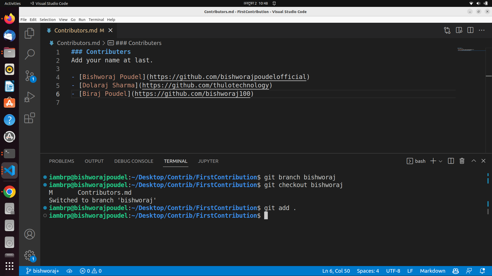
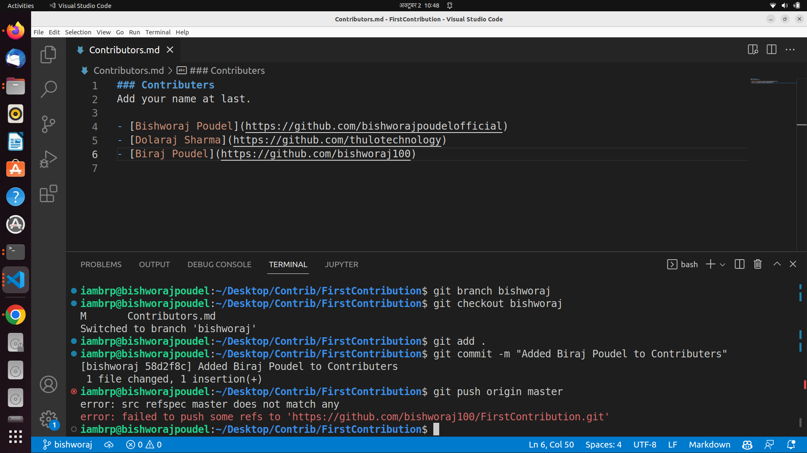
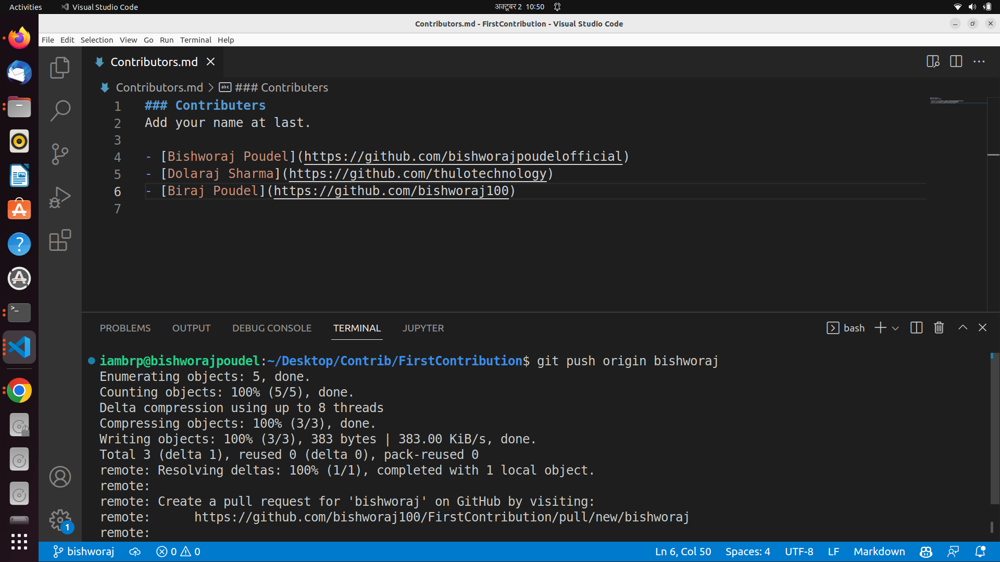

### First Contribution
This is a repository for beginners to practice making their first contribution. If you are looking to make your first contribution, follow the steps below.

### Requirements
- Basic Knowledge of Git and Github.
- Must have logged in to your Github account.

### How to make your first contribution
Here are the steps to make your first contribution:

### Step 1: Fork this repository
Click on the fork button on the top of this page. This will create a copy of this repository in your account.

### Step 2: Clone the repository
You now have a copy of the repository in your Github account. Let us clone it to your machine using the following command.

`git clone <url>`

where url is the url of your forked repository. You can get this url by clicking on the clone button and then clicking the copy to clipboard icon.

### Step 3: Add Your Name To Contributors List
Now open the `Contributors.md` file in a text editor, add your name to it in the following format:

`[Your Name](Your GitHub Profile Link)`

### Step 3: Create a branch
Change to the repository directory on your computer (if you are not already there). Now create a branch using the `git checkout` command.

`git checkout -b <add-your-new-branch-name>`

### Step 4: Make necessary changes and commit those changes
Now open `Contributors.md` file in a text editor, add your name to it, then save the file.

If you go to the project directory and execute the command `git status`, you'll see there are changes. Add those changes to the branch you just created using the `git add` command. Now commit those changes using the `git commit` command.

`git add Contributors.md`
`git commit -m "Add <your-name> to Contributors list"`

### Step 5: Push changes to GitHub
Push your changes using the command `git push origin <your-branch-name>`.

### Step 6: Submit your changes for review
If you go to your repository on GitHub, you'll see a `Compare & pull request` button. Click on that button.

### How to contribute
1. Add your name to the `CONTRIBUTORS.md` file.
